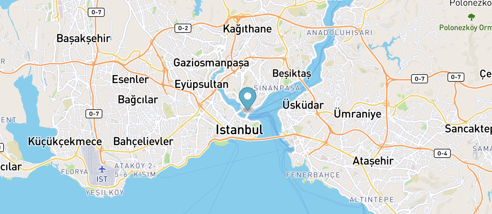
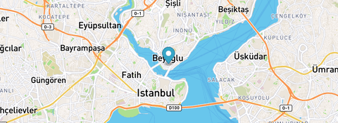
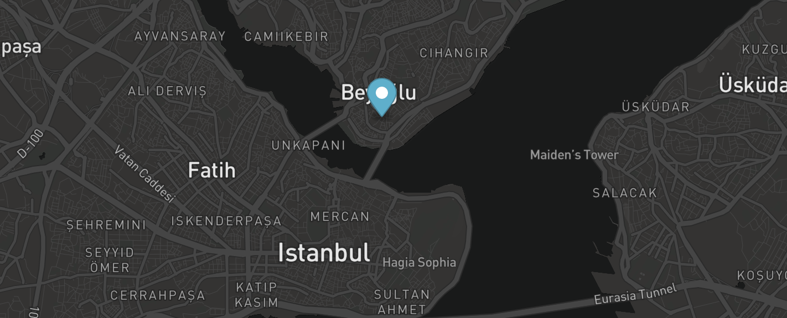

Merhabalar sayın bu yazıyı okuyan,

Bu yazı ilk blog yazım olduğu için hatalarım olabilir, affınıza sığınarak başlıyorum.

<div className="Image__Small">
    <div style="width:100%;height:0;padding-bottom:57%;position:relative;"><iframe src="https://giphy.com/embed/lrVjN0kDB742fl1fgE" width="100%" height="100%" style="position:absolute" frameBorder="0" class="giphy-embed" allowFullScreen></iframe></div>
</div>

İlk olarak mapbox.com giriş yaptıktan sonra [Mapbox](https://account.mapbox.com/) adresinden access tokenimizi alıyoruz. Kopyaladığımız tokeni bir not defterine kaydetmenizi öneririm.

### Adım 1 – Html sayfası hazırlanması.

İlk olarak boş bir .html sayfası oluşturalım ve gerekli mapbox kaynak dosyalarını ekleyelim.

```html
<!DOCTYPE html>
<html>
  <head>
    <meta charset="utf-8" />
    <title>Mapbox ile siteye harita eklemek.</title>

    <meta name="viewport" content="initial-scale=1,maximum-scale=1,user-scalable=no" />
    <script src="https://api.mapbox.com/mapbox-gl-js/v1.12.0/mapbox-gl.js"></script>
    <link href="https://api.mapbox.com/mapbox-gl-js/v1.12.0/mapbox-gl.css" rel="stylesheet" />

    <style>
      body {
        margin: 0;
        padding: 0;
      }
      #map {
        position: absolute;
        top: 0;
        bottom: 0;
        width: 100%;
      }
    </style>
  </head>

  <body></body>
</html>
```

### Adım 2 – Mapbox Entegresi

Body alanımıza bir div oluşturup id verelim. Mapbox gerekli kaynak ve çizimleri #map divine yansıtacaktır.

```html
<body>
  <div id="map"></div>
</body>
```

Sıra geldi **javascript** kodlarımıza:

İlk önce hangi koordinatlara marker ekleyeceğimizi belirlemek için https://epsg.io/map adresinden koordinatlarımızı belirleyelim.

```javascript
var place = [28.9741287, 41.0256678] // istanbul

mapboxgl.accessToken = 'buraya tokenimizi yazıyoruz.'
var map = new mapboxgl.Map({
  container: 'map',
  style: 'mapbox://styles/mapbox/streets-v11', // kullanacağımız tema (alt kısımda bu konuya değineceğim)
  center: place, // istanbul
  zoom: 11 // yakınlaşma derecesi
})
```

### Adım 3 – Marker ekleme işlemi

```javascript
var marker = new mapboxgl.Marker()
  .setLngLat(place) //istanbul
  .addTo(map)
```

Marker ekleme işlememiz başarı ile gerçekleşti.

<div className="Image__Small">
  
</div>

**Zoom** seviyesi arttırıp azaltarak yakınlık ve uzaklığı ayarlayabilirsiniz.

### Adım 4 – Marker’a tıklama işleminin ardından pop-up gösterme aksiyonu

Pop-up bileşeni oluşturalım:

```javascript
var popup = new mapboxgl.Popup({ offset: 25 }).setText('Bereketzade, Galata kulesi, 34421 Beyoğlu/İstanbul.')
```

Marker ekleme kodumuza ekstra olarak **.setPopup** ekleyelim.

```javascript
new mapboxgl.Marker()
  .setLngLat(place)
  .setPopup(popup)
  .addTo(map)
```

Pop-up ekleme işlemimiz de tamamlandı.

<div className="Image__Small">
  
</div>

### Adım 5 – Tema Değişimi

https://docs.mapbox.com/api/maps/#styles bu adresten haritamıza yerleştireceğimiz stillere göz atabilirsiniz. Ben şu an için dark temasını kullanacağım. Url kısmını kopyalayıp kodumuzdaki style alanına yapıştırıyorum.

```javascript
var map = new mapboxgl.Map({
  ...
  style: 'mapbox://styles/mapbox/dark-v10',
  ...
});
```

Ve en son görüntümüz bu şekilde oluştu.

<div className="Image__Small">
  
</div>

**Mapbox Ücretlendirme Politikası** : https://www.mapbox.com/pricing/

Mapbox web sürümünü 50.000 **Api** isteğine kader ücretsiz kullanabilirsiniz.

**Api isteği** : Web uygulamasının haritayı ilk başlattığı anda yaptığı işlem. Her harita başlangıcı bir işleme denk gelmektedir . Haritanın yüklenmesi sınırsız vector tiles ve raster tiles Api’sinin çalışmasını tetikler, yaptığımız isteğe bunlar dahil edilmez.

**Kodlar**: https://jsfiddle.net/burakalp/xqnd4bLr/

Sorularınız varsa, yorumda bahsederseniz mutlaka yardımcı olmak isterim.

Teşekkürler.

Ayla Sever Çalık‘a verdiği editoryal destek için ayrıca teşekkür ederim.
